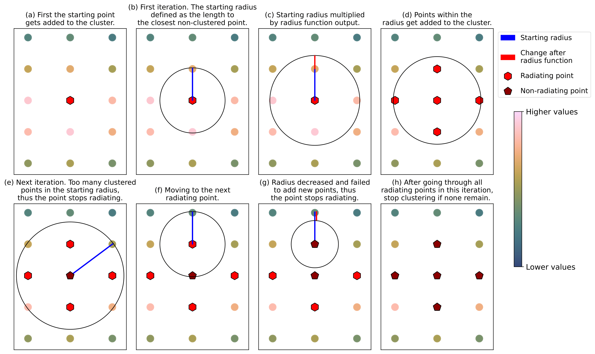
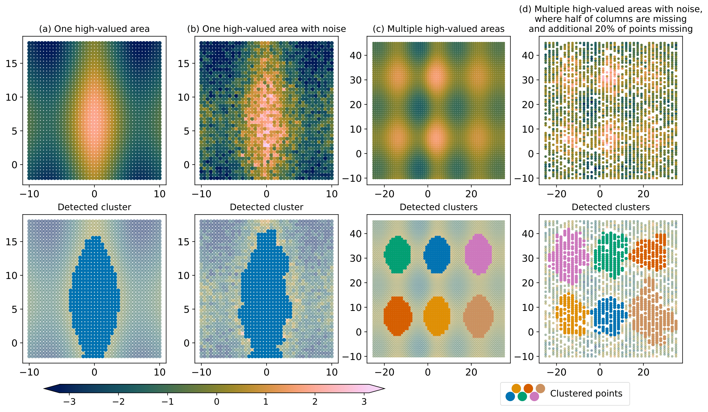
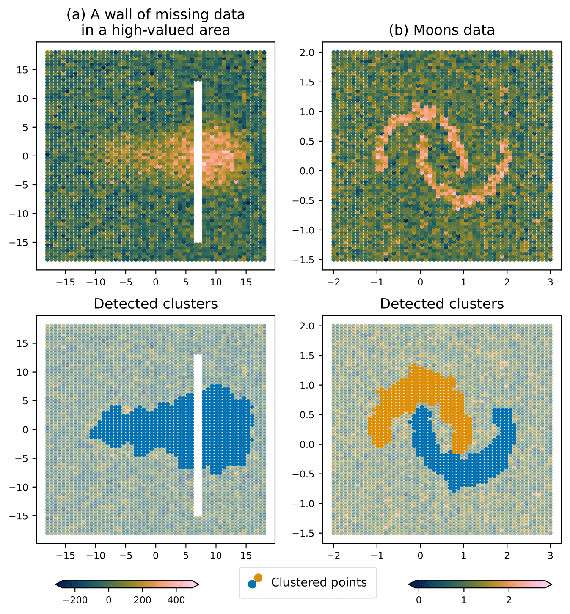
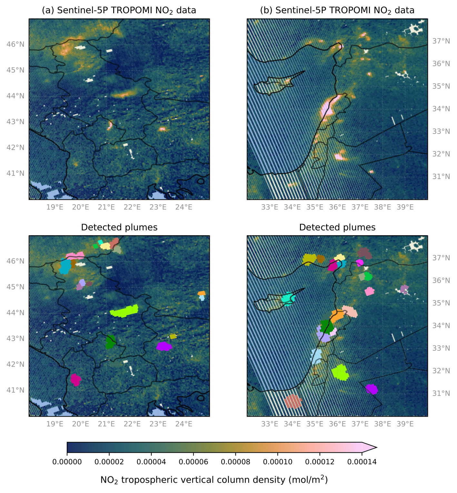

# SCEA

This repository includes code for the SCEA algortihm, unsupervised hotspot detection method for irregularly gridded data.

Paper available at: TBA


<figure>
  
  <figcaption>Figure 1 — Visual explanation of the SCEA algorithm.</figcaption>
</figure>


## Examples

<figure>
  
  <figcaption>Figure 2 — Demonstrations of SCEA with toy data. The bottom row shows clusters detected from the corresponding top row. Points belonging to the same clusters are denoted with the same color..</figcaption>
</figure>

<figure>
  
  <figcaption>Figure 3 — More demonstrations of SCEA on toy datasets. The detection limit was set to 3.5 and the growth limit was set to 1.0. </figcaption>
</figure>

<figure>
  
  <figcaption>Figure 4. — SCEA used as a plume detection method on two different scenes, with bottom row showing the results from the corrseponding top row. Data from different scenes of Sentinel-5P TROPOMI NO$_2$ instrument on dates 2024-06-12 and 2024-06-05 for Fig. (a) and Fig. (b), respectively. Quality filter of 70 \% was used. Detection limit was set to 3.5 and growth limit was to 2.2 to both scenes.</figcaption>
</figure>


## The SCEA algorithm implementation
syntax is as follows:

````
clusters = SCEA(
    point_coordinates,  
    point_values,  
    growth_limit=2,  
    detection_limit=3.5, 
    radius_func="default",  
    n_clusters="auto",
    point_value_threshold="stds_from_median",
    distance_matrix="euclidean",
    max_points_in_start_radius=7,
    local_box_size=0,
    verbose=True,
)
````
where arguments are as follows:

| Argument                   | Description                                                                                                 |
|---------------------------:|-------------------------------------------------------------------------------------------------------------|
| point_coordinates         | Array with shape (n_points, n_dimension)                                                                    |
| point_values              | Array with shape (n_points)                                                                                 |
| growth_limit              | Smaller value → larger clusters (controls cluster growth)                                                   |
| detection_limit           | Smaller value → more clusters (controls detection sensitivity)                                              |
| radius_func               | Radius function to use (e.g., "default" or a user-defined callable)                                         |
| n_clusters                | Integer to find a fixed number of clusters, or "auto"                                                        |
| point_value_threshold     | Threshold to stop detecting new clusters. Can be absolute or "stds_from_median" (then detection_limit is used) |
| distance_matrix           | Precomputed distance matrix or "euclidean"                                                                   |
| max_points_in_start_radius| Condition for killing a "radiating point" (max points allowed in start radius)                              |
| local_box_size            | Local area size considered (0 = global)                                                                      |
| verbose                   | If true, print log information                                                                                |


[Download Figure 1 (PDF)](figures/fig3.pdf)
